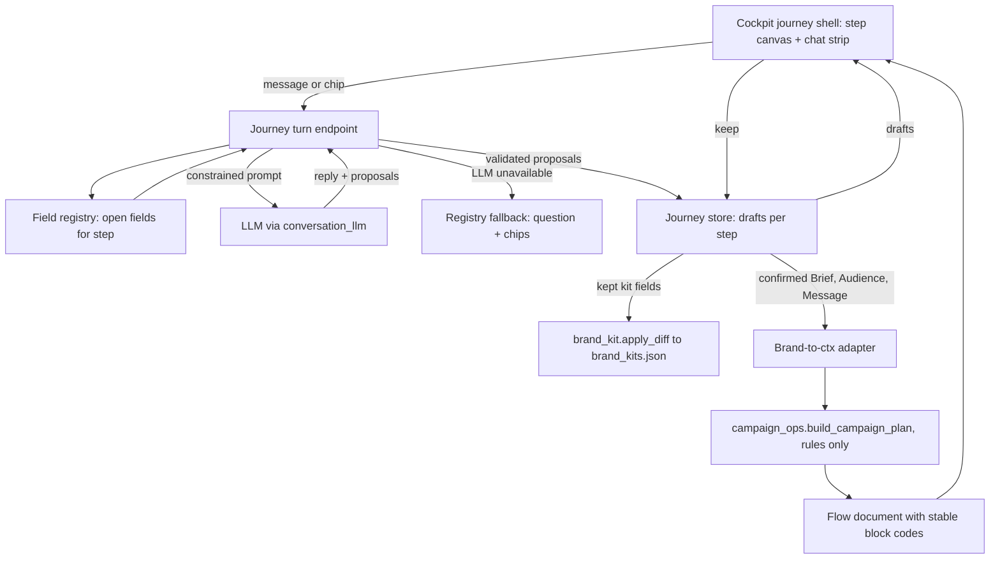
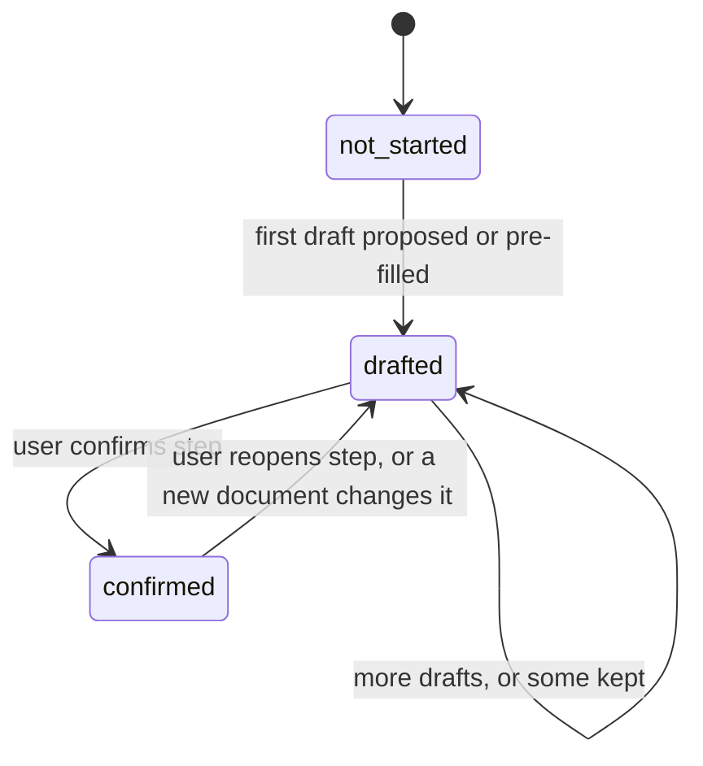

# Agentic Brand Journey - Plan

## Goal Capsule

- **Objective:** A brand marketer goes from "new brand" to a confirmed brief, audiences, message house, compliance kit, and first campaign flow in one guided journey, steered by short agent exchanges instead of forms and one-shot diffs.
- **Means:** A declarative staged field registry and journey store on the backend, one step-scoped agent turn endpoint, and a new Cockpit journey shell that replaces the guided update screen (KTD1-KTD4). The Flow step reuses the Campaign Ops flow-builder through a Vite alias and a brand-to-ctx adapter (KTD6, KTD7).
- **Product authority:** This plan covers the Cockpit journey end to end (intake, kit depth, flow planning) as one interaction model. It supersedes the current "+ Brand" setup and the 5-tab guided update screen. Product Contract wins on behavior; KTDs win on mechanism.
- **Execution profile:** Deep. Eight units in four phases: backend journey core (U1-U3), Cockpit journey UI (U4-U5), flow (U6-U7), cleanup (U8).
- **Stop conditions:** Stop and report if the flow-builder cannot run inside the Cockpit bundle with a single React instance (KTD7), or if `campaign_ops.build_campaign_plan` cannot produce a flow from a brand-derived ctx without a project (KTD6).
- **Open blockers:** None.

---

## Product Contract

### Summary

A five-step journey (Brief, Audience, Message, Kit, Flow) replaces "+ Brand", the guided update screen, and the empty workspace sections.
Each step is a canvas the user builds, steered by a small step-scoped chat where the agent asks one question at a time and the canvas updates as a reviewable draft.
The brand workspace becomes the journey's read-only summary.

### Problem Frame

The Cockpit today collects almost nothing about a brand before drafting.
"+ Brand" asks for a document, a name, and a territory, then five agents each propose a one-shot diff over a fixed slice of fields.
There is no dialogue that learns what the brand is trying to achieve, so audiences, messages, and constraints are only as good as whatever the document happened to say.
The workspace then shows many sections as "Not available in this kit", and nothing connects the kit to an actual campaign flow.
The novartis accelerate app already solves the adjacent problems: a staged requirements interview where the system chooses the next question and early answers gate later ones, and a rules-built flow planner edited through structured chat operations.

### Key Decisions

- **One journey, one interaction model across intake, kit, and flow.** Splitting them would produce three different chat styles. (session-settled: user-directed — chosen over brainstorming each area separately: the user wants one agentic interface for all three.) Governs R1, R2.
- **Step-scoped, short chat; the canvas is the product.** Each step's chat starts clean, exchanges are one or two messages, and history is retained but not foregrounded. (session-settled: user-directed — chosen over a persistent per-section transcript: the chat should not feel continuously stored.) Governs R3, R4, R5.
- **The system picks the next question; the agent phrases it.** Adopted from the novartis requirements interview. It prevents the agent from wandering and lets early answers gate later questions. (session-settled: user-approved — chosen over free-form agent questioning.) Governs R8, R9.
- **Agent changes land as drafts the user keeps or undoes.** The canvas updates immediately, but nothing is committed to the brand without a keep. This keeps the current compliance gate while making edits feel instant. (session-settled: user-approved — chosen over auto-applying agent edits.) Governs R6, R7.
- **Message merges today's brand-details and brand-persona tabs.** Positioning, claims, pillars, and voice are one decision. (session-settled: user-approved.) Governs R13.
- **Rules build the flow; chat only makes structured edits.** Adopted from the novartis flow planner. A pharma flow must be auditable and reproducible, and a freehand LLM flow is neither. (session-settled: user-approved — chosen over LLM-generated flows.) Governs R16, R17.
- **Reuse the existing Campaign Ops flow-builder for the Flow step.** One flow editor in the product, not two. (session-settled: user-approved — chosen over porting the novartis diagram.) Governs R18. Conflict call-out: research found this is workable but not free. The flow-builder lives in `frontend/` with dependencies the Cockpit lacks, and `strategy/campaign_ops.py` builds from a project plan context, not a brand. KTD6 and KTD7 carry the adapter cost.
- **A full plan document pre-fills every step.** The user lands on a review pass instead of starting cold. (session-settled: user-approved — chosen over always starting at Brief.) Governs R10.
- **Retire the guided update screen and its persisted per-section chats.** Updating a brand becomes reopening a step. (session-settled: user-approved — chosen over keeping both.) Governs R20.

### Actors

- A1. Brand marketer: owns the brand, answers questions, keeps or undoes drafts.
- A2. Journey agent: phrases the next question, proposes drafts, and applies chat edits. It never commits without A1.
- A3. Rules engine: decides which questions are open next, and builds the campaign flow from confirmed inputs.

### Requirements

**Journey shell**

- R1. A brand's journey has five ordered steps: Brief, Audience, Message, Kit, Flow. Each step shows a status of not started, drafted, or confirmed.
- R2. The user can open any step at any time. A step whose prerequisites are unconfirmed shows what it is waiting on instead of blocking silently.
- R3. Each step has a canvas as its primary surface and a compact chat strip beneath it. The chat never takes over the screen.
- R4. Each step's chat starts clean on entry. Earlier turns collapse into a count ("3 earlier notes") that expands on demand. History is retained but not shown by default.
- R5. An agent turn is one short message: at most one question, with 2 to 4 suggested answers as chips plus free text.

**Drafts and commit**

- R6. Every agent-proposed change appears on the canvas as a highlighted draft, with keep and undo on the draft and a keep-all per step.
- R7. Only kept content is written to the brand. Undone or abandoned drafts leave the brand unchanged.

**Interview behaviour**

- R8. The next question comes from the set of open fields for the current step, in a defined stage order. The agent phrases the question but does not invent it.
- R9. Answers gate later questions, so a field appears only when earlier answers make it relevant. For example, branded versus unbranded changes the Message and Kit questions.
- R10. When the user supplies a brand-plan document, the agent pre-fills every step it can support and lands the user on a review pass. Pre-filled values are drafts under R6.
- R11. Without a document, the journey starts at Brief with a one-sentence prompt ("tell me about the brand") and interviews from there.

**Step content**

- R12. Brief captures brand name, indication, territory, lifecycle stage, objective, success measure, and whether the brand is branded or unbranded. Territory is a chip question with an "other" free-text option.
- R13. Message holds a message house: core claim, pillars, proof points, and voice. A claim with no supporting evidence is visibly flagged.
- R14. Audience holds HCP and patient persona cards. The user can refine one card through a chat instruction scoped to that card.
- R15. Kit holds compliance content: dos and don'ts, approved indication, and safety reference, pre-filled from earlier steps. Content the agent cannot support is flagged, not guessed. Confirming Kit locks it until the user reopens it.

**Flow**

- R16. The first campaign flow is built by rules from the confirmed Brief, Audience, and Message: channels, waits, decisions, and suppressions.
- R17. Chat edits to the flow are applied as structured operations (add, remove, connect, change). Block identifiers stay stable when the flow is rebuilt.
- R18. The Flow step presents the existing Campaign Ops flow-builder rather than a second diagram editor.

**Workspace and updates**

- R19. The brand workspace summarises the journey read-only. An empty area reads "Not planned yet" and links to the step that fills it.
- R20. Updating an existing brand means reopening a step. Uploading a new document proposes drafts only on the steps it changes, and says which ones.

### Key Flows

- F1. New brand with a plan document
  - **Trigger:** A1 clicks "+ Brand" and uploads a plan.
  - **Actors:** A1, A2, A3
  - **Steps:** Every step supported by the document is pre-filled as drafts. A1 lands on a review pass and keeps or undoes per step. A2 asks only about the fields still open, one at a time.
  - **Outcome:** Brief through Kit confirmed; Flow is built by rules.
  - **Covered by:** R6, R7, R8, R10, R16
- F2. New brand without a document
  - **Trigger:** A1 clicks "+ Brand" and types a sentence.
  - **Actors:** A1, A2, A3
  - **Steps:** A2 drafts the Brief card from the sentence. A3 opens the next fields in stage order, and A2 asks each as a chip question.
  - **Outcome:** Same as F1, reached by interview.
  - **Covered by:** R8, R9, R11, R12
- F3. Editing a flow by chat
  - **Trigger:** A1 types "add a rep follow-up after the second email" on the Flow step.
  - **Actors:** A1, A2, A3
  - **Steps:** A2 turns the request into structured operations. The flow updates as a draft, with existing block identifiers unchanged.
  - **Outcome:** A1 keeps or undoes the change.
  - **Covered by:** R6, R17
- F4. Updating an existing brand
  - **Trigger:** A1 uploads a revised plan for an existing brand.
  - **Actors:** A1, A2
  - **Steps:** A2 identifies which steps the document changes and proposes drafts only there.
  - **Outcome:** Unchanged steps stay confirmed.
  - **Covered by:** R10, R20

### Acceptance Examples

- AE1. **Covers R9.** **Given** Brief marks the brand as unbranded, **when** A1 opens Message, **then** questions about product claims do not appear.
- AE2. **Covers R6, R7.** **Given** A2 proposes three persona cards, **when** A1 keeps one and leaves the step, **then** only that card is saved, and the other two do not reappear as saved content.
- AE3. **Covers R4.** **Given** A1 had a five-turn exchange on Audience, **when** A1 returns to Audience, **then** the chat shows a clean prompt and a "5 earlier notes" link, not the transcript.
- AE4. **Covers R17.** **Given** a flow with blocks B1 to B6, **when** A1 adds a node through chat and the flow is rebuilt, **then** B1 to B6 keep their identifiers.
- AE5. **Covers R2.** **Given** Brief is unconfirmed, **when** A1 opens Flow, **then** Flow shows that it is waiting on Brief, Audience, and Message rather than an empty diagram.

### Scope Boundaries

- Executing or publishing campaigns. This remains a planning tool.
- Admin-editable question sets. The stage order and field set stay in code for now.
- Multi-user collaboration or approvals workflow on a brand.
- Territory-specific content variants beyond the single confirmed territory per brand.

### Dependencies / Assumptions

- The Flow step depends on the Campaign Ops flow-builder in `frontend/` being embeddable in the Cockpit (`cockpit/`). If it cannot be embedded cleanly, R18 needs revisiting.
- The novartis patterns are adopted as design references, not copied code: the interview state and next-question selection (`accelerate-app/client/src/pages/RequestDetailPage.tsx`, `accelerate-app/server/server.js` agent-fill prompt) and the rules-built flow with structured chat edits (`accelerate-app/server/segmentation/`).
- Existing kits (Cardiovex, Oncomyra, and brands created through "+ Brand") must open in the new journey without data loss.

### Outstanding Questions

Both questions deferred from the brainstorm are resolved in the Planning Contract: flow rules come from the existing `strategy/campaign_ops.py` builder (KTD6), and existing kit-update drafts and chats are discarded (KTD8). No open questions remain.

### Sources / Research

- Cockpit's current new-brand and update surfaces: `cockpit/src/components/KitUpdateScreen.tsx`, `strategy/kit_chat.py`, `strategy/kit_drafts.py`.
- Existing flow-builder: `strategy/campaign_ops.py` and `frontend/src/workspace/stages/operations/flowbuilder/`.
- Novartis requirements interview and flow planner: the sibling novartis project's `accelerate-app/` (outside this repo), plus its design doc `hqe-requirement-platform-design-doc.md`.

Product Contract preservation: changed: R12 — adds branded or unbranded, which AE1 and the registry already required. Otherwise unchanged except Outstanding Questions, resolved in place by KTD6 and KTD8, and a conflict call-out added to the flow-builder Key Decision.

---

## Planning Contract

### Key Technical Decisions

- KTD1. **A declarative field registry drives the interview.** A new `strategy/journey_fields.py` lists every field with its step, stage order, target (a brand-kit field or a journey-only answer), question text, chip options, and an optional condition on earlier answers. Next-question selection is a pure function over the registry and current answers. The LLM never chooses the question. Instantiates the Key Decision governing R8 and R9 (session-settled: user-approved — chosen over free-form agent questioning: keeps the interview on track). Precedents: `strategy/questionnaire.py` and `strategy/studio_run.py` `SEQUENCE`.
- KTD2. **A journey store owns step state, drafts, and step chat.** A new `strategy/brand_journey.py` backed by its own SQLite file `brand_journey.db` under `DATA_DIR`, through `strategy/paths.py`, the same pattern as `strategy/kit_drafts.py`. It holds per brand: journey-only answers, pending drafts per step, step status, step chat turns, and the flow document. Kept values that map to kit fields are written through `brand_kit.apply_diff`, so `config/brand_kits.json` stays the kit's source of truth. Step status is checked against the kit on read: a confirmed step whose kept kit fields are missing reads as drafted. A brand with no journey rows derives each step's status from its kit; a step whose required registry fields are all present is confirmed, otherwise drafted. A missing gating answer such as `branded` is an open Brief question, and fields gated on it wait until it is answered.
- KTD3. **One agent turn per user message, scoped to the current step.** A single endpoint takes the step and the user's message. It returns a short reply, the next question with chips, and proposed values for open fields of that step only. Proposals are validated against the registry and the `_FIELD_SHAPES` hints in `strategy/kit_chat.py`, then stored as drafts (R6). When the LLM is unavailable, the turn falls back to the registry: question text and chips come from the registry, and a chip or short free-text answer is stored directly as a draft for scalar fields. This follows the repo's degrade-never-fail rule.
- KTD4. **New journey-only fields become optional brand-kit fields.** `lifecycle_stage`, `success_measure`, `branded`, and `primary_audience` are added as optional fields to the `BrandKit` type in `cockpit/src/types.ts` and written through `apply_diff`. Research found these fields missing today. Keeping them on the kit means the workspace (R19) and the flow adapter (KTD6) read one source.
- KTD5. **Document pre-fill reuses the kit extraction path, per step.** On upload, the backend extracts text with `strategy/document_intake.py`, then runs one extraction call per content step concurrently, each constrained to that step's registry fields. Results become drafts, and the journey lands on a review pass (R10). This replaces `kit_chat.kickoff_all` and its five fixed sections.
- KTD6. **The Flow step builds a campaign flow from a brand-derived ctx.** A new adapter in `strategy/brand_journey.py` builds the minimal ctx that `build_campaign_plan` in `strategy/campaign_ops.py` reads, from the kept kit and journey answers. `brand_kit.content_library_from_kit` already covers the content part. Project-only ctx keys get empty defaults. The builder runs with its LLM operational-detail step off, so the flow is rules-built and reproducible (R16). This resolves the brainstorm's deferred question on where flow rules come from.
- KTD7. **The Cockpit renders the existing flow-builder through a Vite alias, not a copy.** `cockpit/vite.config.ts` aliases the `frontend/src` root, because the campaign adapter (`frontend/src/workspace/stages/operations/campaignAdapter.ts`), the frontend workspace types, and `frontend/src/theme/tokens.ts` sit outside the flow-builder folder and must resolve too. It dedupes `react` and `react-dom` so one React instance runs. The Cockpit adds the flow-builder runtime dependencies (`@xyflow/react`, `zustand`, `zod`, `elkjs`, `@dagrejs/dagre`, `html-to-image`) to `cockpit/package.json`. The two flow-builder files that import MUI (`@mui/material` and `@mui/system`) get a Cockpit-side shim, or those packages are added if a shim is not clean. Bare imports in aliased files must resolve to `cockpit/node_modules`, so a Cockpit-only install builds. Instantiates the flow-builder Key Decision governing R18 (session-settled: user-approved — chosen over porting the novartis diagram: one flow editor in the product).
- KTD8. **Stable block codes and structured edits live on the journey's flow document; old kit-update data is discarded.** Each flow node gets a block code assigned once from a stable key (node type plus semantic source), preserved across rebuilds (R17). Chat edits on the Flow step use the KTD3 turn with an operations envelope (add, remove, connect, change) instead of field proposals, and the result lands as a draft. The stored flow is the rules-built `CampaignFlow` plus the ordered list of kept operations. A rebuild regenerates the skeleton from inputs, then reapplies kept operations by block code; an operation whose target no longer exists is dropped and reported. The flow-builder is read-only on the Flow step; edits come only through chat operations. Existing rows in `kit_drafts.db` and `kit:` chat rows in `tab_chat.db` are discarded when the guided update screen is retired, because published content already lives in the kit. This resolves the brainstorm's deferred migration question.

### High-Level Technical Design

Data flow from a user message to a kept value and a flow:

Step status per step:

A step is `waiting` when a prerequisite step is not confirmed. That flag is computed on read, not stored, so the R2 message cannot drift from the prerequisites.

### Assumptions

- The flow-builder's zustand store and schema run outside `frontend/` once `react` and `react-dom` are deduped. U7 proves this first and stops per the Goal Capsule if it fails.
- `build_campaign_plan` tolerates empty defaults for project-only ctx keys (`bam`, `kpi`, `journey_spec`, `micro_journeys`, `studio_answers`). U6 confirms which keys need defaults.
- Brand data stays in the committed `config/brand_kits.json`. Moving it to `DATA_DIR` for Render durability is out of scope. Known limitation: on Render, a redeploy resets the kit file while `brand_journey.db` persists. The KTD2 read-time check keeps status honest, but kept values are lost until the kit moves.
- `build_campaign_plan` accepts `use_llm=False` and produces identical output for identical ctx. U6 confirms this and stops per the Goal Capsule if it does not.
- Aliased `frontend/` sources typecheck under the Cockpit's stricter TypeScript settings. U7's first proof includes `npx tsc -b --noEmit` in `cockpit/`.

### Sequencing

U1 then U2 then U3 build the backend core. U4 depends on U3. U5 depends on U4. U6 depends on U2. U7 depends on U4 and U6. U8 runs last.

---

## Implementation Units

### U1. Staged field registry and next-question engine

**Goal:** Define every journey field and a pure function that returns the open and next questions for a step.

**Requirements:** R8, R9, R12, R13, R14, R15. KTD1.

**Dependencies:** None.

**Files:** `strategy/journey_fields.py` (new), `scripts/verify_brand_journey.py` (new).

**Approach:**
1. Define Brief, Audience, Message, Kit, and Flow. Each field records step, stage order, target (kit field or journey-only key), question, chips, and an optional condition over earlier answers.
2. Brief: brand name, `indication`, `territories`, `lifecycle_stage`, `key_objective`, `success_measure`, `branded`. Audience: `primary_audience`, `personas`, `competitors`. Message: `core_claim`, `positioning_statement`, `tagline`, `message_hierarchy`, `tone_pillars`, `voice_do`, `voice_dont`, `brand_personification`. Kit: `guardrails`, `approved_indication`, `safety_reference`.
3. When `branded` is `unbranded`, product-claim fields on Message are not open (AE1).
4. Expose `open_fields(step, answers)`, `next_questions(step, answers, limit)`, and `step_prerequisites(step)`.

**Patterns to follow:** `strategy/questionnaire.py` field lists; `KIT_SECTIONS` in `strategy/kit_chat.py` for field ownership.

**Test scenarios:**
- An empty Brief returns brand name as the first question.
- After brand name and indication are answered, the next question is territory.
- Covers AE1. With `branded = unbranded`, `open_fields("message", ...)` excludes `core_claim`.
- Every registry field with a kit target names a real `BrandKit` field or a KTD4 field.
- `step_prerequisites("flow")` returns Brief, Audience, and Message.

**Verification:** The verify script's registry checks pass, and every field is reachable from an empty state by answering earlier fields.

### U2. Journey store: drafts, keep and undo, commit to kit

**Goal:** Persist journey state and turn kept drafts into kit writes.

**Requirements:** R1, R4, R6, R7, R20. KTD2, KTD4.

**Dependencies:** U1.

**Files:** `strategy/brand_journey.py` (new), `strategy/brand_kit.py`, `cockpit/src/types.ts`, `scripts/verify_brand_journey.py`.

**Approach:**
1. Create tables for answers, drafts, step status, step chat turns, and the flow document in `brand_journey.db`.
2. `propose` stores a draft. `keep` writes kit-targeted values through `brand_kit.apply_diff` and journey-only values to answers. `undo` deletes drafts only.
3. `journey_state(brand)` returns per-step status, computed `waiting` flags, pending drafts, the current open question as a fresh prompt, and the count of earlier turns (R4). Earlier turns are returned only on request.
4. Add the KTD4 fields to the `create_brand` skeleton and to `BrandKit`.
5. Seed state for existing brands from their kit, so Cardiovex and Oncomyra open with filled fields confirmed.

**Patterns to follow:** `strategy/kit_drafts.py` store shape; `brand_kit.apply_diff` for kit writes and cache clearing.

**Test scenarios:**
- Covers AE2. Three persona drafts, keep one, undo two: `journey_state` shows one kept persona and no drafts.
- Keeping a `tagline` draft updates `config/brand_kits.json`, and `brand_kit.kit_for` returns it without a restart.
- Undoing a draft leaves the kit file byte-identical.
- Covers AE5. Flow reports `waiting` on Brief, Audience, and Message when Brief is unconfirmed.
- Covers AE3. After five chat turns on Audience, `journey_state` returns the current open question as a fresh prompt and `earlier_count` 5.
- An existing brand (Cardiovex) opens with its Brief fields confirmed from its kit.

**Verification:** Verify-script store checks pass against a temporary `DATA_DIR`, and the kit file is restored after the run.

### U3. Agent turn and document pre-fill endpoints

**Goal:** Serve one step-scoped agent turn and document pre-fill over HTTP.

**Requirements:** R3, R5, R8, R10, R11. KTD3, KTD5.

**Dependencies:** U1, U2.

**Files:** `strategy/brand_journey.py`, `app/server.py`, `scripts/verify_brand_journey.py`.

**Approach:**
1. `GET /api/brands/{brand}/journey` returns `journey_state`.
2. `POST /api/brands/{brand}/journey/{step}/turn` takes a message or chip answer. The prompt lists only the step's open fields, current values, and shape hints, and asks for a short reply, at most one question, and proposals. Proposals outside the step's open fields are dropped.
3. `POST /api/brands/{brand}/journey/{step}/keep`, `/undo`, and `/confirm` take draft ids or confirm the step.
4. `POST /api/brands/journey/start` takes an optional file or one-line description, creates the brand via `brand_kit.create_brand`, and runs KTD5 pre-fill when a file is present.
5. `POST /api/brands/{brand}/journey/document` takes a revised document for an existing brand. It runs KTD5 extraction, compares results with kept values, proposes drafts only where they differ, and returns the changed steps (R20). A changed confirmed step, including a locked Kit, moves back to drafted.
6. The KTD3 fallback runs when `conversation_llm.llm_available()` is false or the call fails.

**Patterns to follow:** `/api/brand-kits/setup` in `app/server.py` for multipart handling; `_call_llm` in `strategy/kit_chat.py` for retry and token headroom.

**Test scenarios:**
- A Brief turn with "It's a heart failure drug called Cardiozen" proposes only Brief-field drafts.
- A proposal for a Message field during a Brief turn is dropped.
- With the LLM off, a Brief turn returns the registry's next question and chips, and a chip answer becomes a draft.
- Covers F1. Starting a brand with a sample document creates drafts on at least Brief and Message, and those steps become `drafted`.
- Covers F2. Starting a brand with only a sentence creates it and returns the first Brief question.
- Starting a brand whose name already exists returns 409.
- Covers F4. Uploading a revised document for an existing brand that changes only Message returns Message as the one changed step, with drafts only there.

**Verification:** The verify script exercises the endpoints through FastAPI `TestClient` with the LLM forced off, plus one live smoke run when LLM credentials exist.

### U4. Journey shell: step rail, canvas slot, chat strip, draft controls

**Goal:** Replace the guided update screen and the "+ Brand" entry with the journey shell.

**Requirements:** R1, R2, R3, R4, R5, R6, R11, R20. KTD3.

**Dependencies:** U3.

**Files:** `cockpit/src/components/journey/JourneyScreen.tsx`, `cockpit/src/components/journey/StepChat.tsx`, `cockpit/src/components/journey/DraftBar.tsx` (all new), `cockpit/src/api.ts`, `cockpit/src/types.ts`, `cockpit/src/App.tsx`, `cockpit/src/cockpit.css`.

**Approach:**
1. Add journey API calls to `cockpit/src/api.ts`.
2. `JourneyScreen` renders the step rail with status and waiting reasons, the active canvas (U5, U7), and `StepChat` beneath it.
3. `StepChat` shows the current prompt, chips, a text box, and an "N earlier notes" toggle. Within a live exchange it shows the agent's reply to the last message. While a turn request is in flight, chips and input are disabled and a pending indicator shows. A failed request shows an inline retry and keeps the typed message.
4. `DraftBar` offers keep-all, undo-all, and confirm for the step.
5. `App.tsx` routes "+ Brand" and every "Update" action to the journey. A new brand opens on a start panel with upload or one sentence.

**Patterns to follow:** view switching in `App.tsx`; card styles and tokens in `cockpit.css`; header and close behavior in `KitUpdateScreen.tsx`.

**Test scenarios:**
- Test expectation: none for automated tests -- the repo has no frontend test runner and its instructions forbid inventing one. The browser gate in the Verification Contract covers this unit.

**Verification:** In the browser, "+ Brand" opens the start panel, a sentence starts a brand on Brief, the chat strip shows one question with chips, and returning to a step shows the earlier-notes count.

### U5. Step canvases: Brief, Audience, Message, Kit

**Goal:** Render each content step as a canvas with inline drafts.

**Requirements:** R6, R12, R13, R14, R15. KTD4.

**Dependencies:** U4.

**Files:** `cockpit/src/components/journey/BriefCanvas.tsx`, `cockpit/src/components/journey/AudienceCanvas.tsx`, `cockpit/src/components/journey/MessageCanvas.tsx`, `cockpit/src/components/journey/KitCanvas.tsx` (all new), `cockpit/src/cockpit.css`.

**Approach:**
1. Brief renders a field card. Territory renders as chips with an "other" option.
2. Audience renders persona cards. Clicking a card scopes the next turn to that card (R14). `StepChat` names the scoped card, and clicking it again or a "back to Audience" control returns to step-level questions.
3. Message renders the message house and flags claims with empty evidence (R13).
4. Kit renders dos, don'ts, approved indication, and safety reference, and flags unsupported items. Confirm stays disabled while any flag is unresolved; the user supplies the content or dismisses the flag first. Confirm then locks the step (R15).
5. Drafts render highlighted with keep and undo beside them.

**Patterns to follow:** `BrandPersonaTable.tsx` and `HcpIntelligence.tsx` for personas; `StrategicOverview.tsx` for message display.

**Test scenarios:**
- Test expectation: none for automated tests -- no frontend test runner. The browser gate covers this unit.

**Verification:** In the browser, each canvas shows pre-filled drafts from a sample document, and keep and undo change what persists after a reload.

### U6. Brand-to-ctx adapter, rules-built flow, stable codes, structured edits

**Goal:** Build and edit a brand's campaign flow on the backend.

**Requirements:** R16, R17. KTD6, KTD8.

**Dependencies:** U2.

**Files:** `strategy/brand_journey.py`, `strategy/campaign_ops.py` (only if empty-default handling is needed), `app/server.py`, `scripts/verify_brand_journey.py`.

**Approach:**
1. Build the ctx from kept kit and journey answers. Populate `brand`, `therapy_area` (from the kit's therapy area, else its indication), `brief.audience` and `brief.objective` (from Brief and Audience), `inferred.persona` (from the primary persona), and `content_library` (via `brand_kit.content_library_from_kit`). Give empty defaults only to project-only keys.
2. Call `build_campaign_plan` with LLM operational detail off.
3. Assign block codes from a stable node key. On rebuild, reuse codes for matching keys and give new nodes the next free code.
4. `POST /api/brands/{brand}/journey/flow/build` builds or rebuilds. The Flow turn accepts an operations envelope, applies it to a draft copy, and stores the draft.

**Patterns to follow:** `build_campaign_plan` in `strategy/campaign_ops.py`; `/campaign-plan/generate` in `app/server.py`.

**Test scenarios:**
- A brand with confirmed Brief, Audience, and Message builds a flow with at least one send, one wait, and one exit node.
- Covers AE4. After adding a node and rebuilding, existing blocks keep their codes.
- A change operation on an unknown block code is rejected with a clear error and no draft.
- Building while Brief is unconfirmed returns the waiting prerequisites, not a flow.
- With the LLM off, the build still succeeds.
- Two builds from the same inputs produce identical documents.

**Verification:** Verify-script flow checks pass.

### U7. Flow canvas in the Cockpit via the shared flow-builder

**Goal:** Show and edit the brand's flow with the existing flow-builder inside the Cockpit.

**Requirements:** R17, R18. KTD7.

**Dependencies:** U4, U6.

**Files:** `cockpit/vite.config.ts`, `cockpit/package.json`, `cockpit/src/components/journey/FlowCanvas.tsx` (new), `cockpit/src/api.ts`, a Cockpit-side MUI shim if needed.

**Approach:**
1. Add the alias and React dedupe, then install the flow-builder dependencies.
2. Convert the journey flow document with the flow-builder's campaign adapter and render it.
3. Route chat edits through the U6 operations envelope, so edits appear as drafts with keep and undo.

**Execution note:** Prove the flow-builder renders in the Cockpit with one React instance, and that `npx tsc -b --noEmit` passes in `cockpit/`, before building edits. Stop per the Goal Capsule if it cannot.

**Patterns to follow:** `frontend/src/workspace/stages/operations/CampaignFlowBuilder.tsx` and its campaign adapter.

**Test scenarios:**
- Test expectation: none for automated tests -- no frontend test runner. The browser gate covers this unit.

**Verification:** `npm run build` in `cockpit/` succeeds, and in the browser the Flow step renders the diagram, a chat edit appears as a draft, and keeping it survives a reload.

### U8. Workspace summary links and retirement of the guided update screen

**Goal:** Point the workspace at the journey and remove retired surfaces.

**Requirements:** R19, R20. KTD8.

**Dependencies:** U5, U7.

**Files:** `cockpit/src/components/BrandWorkspace.tsx`, `cockpit/src/components/SectionMeta.tsx`, `cockpit/src/App.tsx`, `cockpit/src/components/KitUpdateScreen.tsx` (delete), `cockpit/src/components/kitUpdate/` (delete), `app/server.py`, `strategy/kit_chat.py`, `scripts/reset_test_data.py`.

**Approach:**
1. Empty workspace areas read "Not planned yet" and link to the step that fills them.
2. Every "Update" action opens the matching journey step.
3. Delete the guided update screen, the `kit-update` routes, and kit-chat code no longer used. Keep `_FIELD_SHAPES`.
4. Point `reset_test_data.py` at journey data, and clear existing kit-update drafts and chat rows once.

**Patterns to follow:** the existing `SectionMeta` update entry point.

**Test scenarios:**
- After retirement, `GET /api/projects/{pid}/kit-update/{brand}` returns 404.
- `reset_test_data.py --brand X` removes that brand's journey rows and leaves `config/brand_kits.json` untouched.

**Verification:** No live references to `KitUpdateScreen` or `kit-update` remain, and workspace links open the correct steps in the browser.

---

## Verification Contract

| Gate | Command or check | Applies to |
|---|---|---|
| Python syntax | `python -m py_compile` on each changed `strategy/*.py` and `app/server.py` | U1, U2, U3, U6, U8 |
| Journey logic | `python scripts/verify_brand_journey.py` (TestClient, LLM forced off, temporary `DATA_DIR`) | U1, U2, U3, U6, U8 |
| Cockpit types | `npx tsc -b --noEmit` in `cockpit/` | U4, U5, U7, U8 |
| Cockpit lint | `npm run lint` in `cockpit/` | U4, U5, U7, U8 |
| Cockpit build | `npm run build` in `cockpit/`, then restart the server | U4, U5, U7, U8 |
| Browser | Open `/cockpit` on the running server and walk F1, F2, F3, and F4 | U4, U5, U7, U8 |

The repo has no test suite, and its instructions say not to invent one. The verify script follows the existing `scripts/` pattern and is the proof for backend units.

---

## Definition of Done

- Every unit's Verification holds, and every Verification Contract gate passes.
- F1 through F4 work end to end in the browser against the built Cockpit.
- `config/brand_kits.json` holds only real brand data after verification. Test brands created during verification are removed.
- The guided update screen, its routes, and unused kit-chat code are gone, with no dead references.
- No abandoned-attempt code, stray debug output, or unused dependencies remain in the diff.
